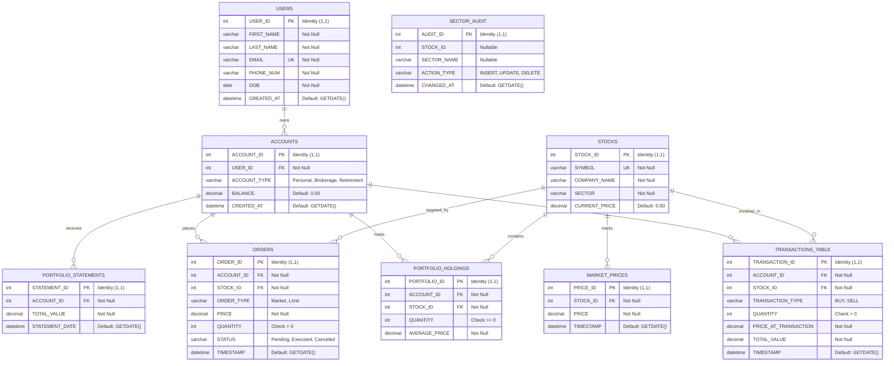
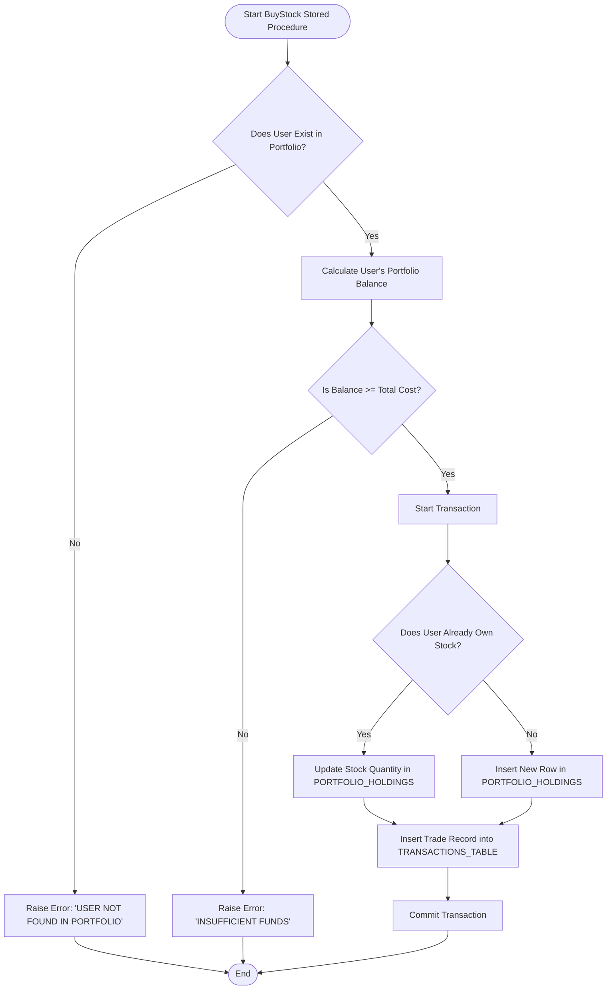

# 📈 Portfolio Management System Database

A production-grade relational database architecture designed to manage user stock portfolios, trade transactions, order books, and real-time market data logs. Built on **Microsoft SQL Server** using **T-SQL (Transact-SQL)**, this project implements a highly relational schema with automated logic through stored procedures, triggers, views, functions, and transactional cursors.

---

## 📊 Badges & Status


---

## 🚀 Overview

This database system simulates the core backend operations of a modern brokerage and trading platform. It ensures strict data integrity, handles real-time portfolio valuation, processes order fulfillment queues, and maintains detailed transaction histories with auditing.

Key system capabilities include:
- **User Demographics & Account Management**: Tracks user details and balance across multiple account types (Personal, Brokerage, Retirement).
- **Transaction Ledger**: Implements an immutable ledger recording every `BUY` and `SELL` transaction.
- **Dynamic Portfolio Tracker**: Real-time average price and share count tracking per account and asset.
- **Order Execution & Queue Processing**: Places `Market` and `Limit` orders and executes them using cursor-driven workflows.
- **Historical Price Tracking**: Simulates tick market data to compute historical valuations.
- **Data Compliance Auditing**: Captures changes to critical data entities through automated triggers.

---

## 🛠️ Technology Stack

- **RDBMS**: Microsoft SQL Server (2017 or higher)
- **Language**: Transact-SQL (T-SQL)
- **Administration & Execution**: SQL Server Management Studio (SSMS) / Azure Data Studio / `sqlcmd`

---

## 📐 Database Schema & Architecture

The database is built on a highly normalized relational model featuring 8 primary tables and a compliance audit log.

### Entity-Relationship Diagram (ERD)



---

## ⚡ Stored Logic & Automation

This project incorporates robust server-side SQL objects to enforce business rules and automate database actions.

### 1. Stored Procedure: `BuyStock`
An ACID-compliant procedure that validates a stock purchase transaction.
- **Workflow**:
  1. Checks if the user exists.
  2. Evaluates whether the user's total portfolio value has sufficient funds to cover the transaction cost (`Quantity * Price`).
  3. Begins a transaction block.
  4. Upserts the holding: updates quantity in `PORTFOLIO_HOLDINGS` if the stock is already owned, or inserts a new row if it is a new asset.
  5. Records the trade in `TRANSACTIONS_TABLE`.
  6. Commits the transaction if all checks pass, otherwise rolls back.



### 2. User-Defined Function: `GetTotalPortfolioValue`
A scalar function that dynamically calculates and returns the current total value of a user's entire portfolio holdings.
- **Logic**: Aggregates `Quantity * Price` by joining `PORTFOLIO_HOLDINGS` with the latest pricing in `MARKET_PRICES` for the requested `USER_ID`.

### 3. Auditing Triggers: `SECTOR_AUDIT` Tracking
Ensures compliance and data change tracing on the `STOCKS` table. Three distinct triggers are implemented:
- `trg_sector_insert`: Captures initial sectors when new stocks are introduced.
- `trg_sector_update`: Fires only when a stock's `SECTOR` value is updated, tracking historical shifts.
- `trg_sector_delete`: Records the deletion of stock records for historical auditing.

### 4. Queue Cursor: `PendingOrdersCursor`
Simulates a trading desk order matching mechanism. 
- Iterates over all rows in `ORDERS` with status `'Pending'`.
- Automatically transitions them to `'Executed'` inside a retry-catch transactional loop.

### 5. Views for Reporting & Analytics
- **`UserPortfolioSummary`**: Compares a user's total investment (cost basis) against the current market value to evaluate performance.
- **`RecentTransactions`**: A rolling 30-day log of all trades for client-facing dashboards.
- **`DailyTradingSummary`**: Aggregates daily transaction volumes (buys vs. sells) per stock symbol.

---

## 📂 File Hierarchy

```
portfolio-management-system-db/
├── code.sql          # Core script containing schema, triggers, SPs, functions, and test cases
├── Report            # Supplementary documentation (placeholder file)
├── README.md         # Premium project documentation & diagrams
└── .gitignore        # Git exclusion configurations for development environments
```

---

## ⚙️ Installation & Run Guide

Follow these steps to deploy and run this database on your SQL Server instance:

### Prerequisites
- **Microsoft SQL Server (2017+)** installed locally or hosted.
- **SQL Server Management Studio (SSMS)** or **Azure Data Studio**.

### Step 1: Clone the Repository
```bash
git clone https://github.com/rahul0443/portfolio-management-system-db.git
cd portfolio-management-system-db
```

### Step 2: Execute the Script
1. Open your database client (e.g., SSMS) and connect to your SQL Server instance.
2. Open the file `code.sql`.
3. Execute the script (`F5` or click **Execute**).
   - This will drop any existing database named `GROUP7`.
   - It will create the database `GROUP7`, construct all 8 relational tables, define the views, functions, stored procedures, triggers, and cursors.
   - It will seed the database with mock data (20 users, 20 accounts, 20 stocks, transactions, market data, and order history).

### Step 3: Run Seed Testing
The bottom of `code.sql` includes pre-written test suites. You can run individual test sections to verify logic:
- **Procedure Test**: Execute `BuyStock` to test account balance checks and portfolio upsert functionality.
- **Trigger Test**: Insert/Update/Delete rows in the `STOCKS` table and check the `SECTOR_AUDIT` log.
- **UDF Test**: Run `SELECT dbo.GetTotalPortfolioValue(1)` to fetch real-time portfolio pricing.
- **Cursor Test**: View `ORDERS` before and after running the cursor script to see pending orders process.

---

## 👥 Authors

- **Rahul Muddhapuram** — *Co-Author*
- **Ishan Ojha** — *Co-Author*

---

## 📄 License

This repository is shared for educational and reference purposes only. Commercial redistribution or replication of the logic is prohibited without explicit consent from the project owners.
